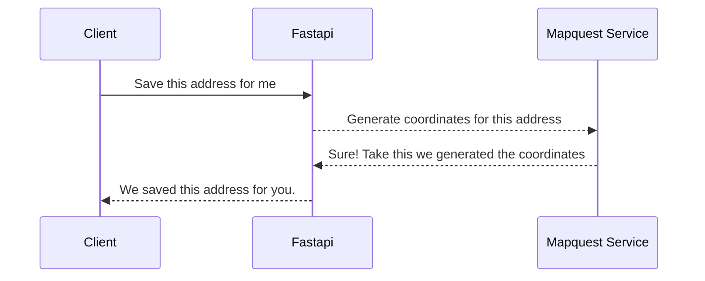

# Address Book App
This address address book app stores address by users so that later these addresses can be updated/deleted/fetched.

## Register
Users will need to register their account with this app. If user is not registered then the app won't allow access to the REST endpoints.

## Login
After user is registered, user can login to fetch the JWT access token. Fastapi verifies this access to store the addresses. When users tries to fetch the addresses, user can only view the address that they stored, due to this JWT authentication.

## Add Address
Users can store addresses with this endpoint. We take the following values in the request body
**house_no
street
locality
city
state
postal_code
country**

## List Address
This endpoint returns all the addresses stored by the users.

## Get Nearby Location
This endpoint returns the addresses within a specific distance. We take the following in the request body
**house_no
street
locality**
We also take a specified distance( in meters ) in the query params, but the default is 5000m
> **NOTE**: The distance should be entered in meters

## Update Address
API used to update a specific address. User needs to mention the address id in the query params and add the required fields to be updated in request body.

## Delete Address
API used to delete a specific address. User needs to mention the address id in the query params.

# Generating Coordinates
We have leveraged the third party api from `Mapquest geocoding api`.
Details can be found here https://developer.mapquest.com/documentation/geocoding-api/
We take the address from the users and generate the coordinates based on that address.
> **NOTE**: The `house_no`, `street` and `locality` needs to be clear to generate an accurate coordinate.

# Design

The following is the design off how we store and generate coordinates.


# Folder structure
```markdown
├── accounts
│   ├── jwt.py
│   ├── models.py
│   ├── serializers.py
│   ├── utils.py
│   ├── validators.py
│   └── views.py
├── address
│   ├── models.py
│   ├── serializers.py
│   ├── utils.py
│   ├── validators.py
│   └── views.py
├── backend
│   ├── app.py
│   ├── config.py
│   ├── db
│   │   ├── base.py
│   │   ├── hash.py
│   │   ├── __init__.py
│   │   └── session.py
│   ├── handlers
│   │   └── exception.py
│   ├── __init__.py
│   ├── log.py
│   ├── middleware
│   │   ├── auth.py
│   │   ├── base.py
│   │   ├── __init__.py
│   │   └── stats.py
│   ├── routes.py
│   ├── status_codes.py
│   └── views.py
├── config
│   ├── docker-compose.yaml
│   └── .env
├── Dockerfile
├── manage.py
├── requirements.txt
├── sql.db
└── tests
    ├── Address Book Env.postman_environment.json
    └── Address Book.postman_collection.json

```
# Start application
There are multiple ways to start the application. The easiest and the fastest way is to run by docker.
**Since we are working with spatial data, so there are extensions required to be installed for sqlite. Intead of manually installing the extensions, the docker setup is ready to automate the process**
## Docker
1. Install `docker` and `docker compose` with their latest version.
2. Go to `./config` directory. You can find this directory in the project root dir.
3. Run `docker compose build`
4. Once build is succesfull run `docker compose up`
5. Your server is now started.
> **NOTE** Some older versions of docker use `docker-compose build` and `docker-compose up` so please use the lates version.
## Gunicorn
1. Go to `root` directory for the project.
2. Activate environment variables by using command `set -a && . ./config/.env` ( This is for linux based OS. For windows you need to manually setup `Environment Variable` or use dotenv https://pypi.org/project/python-dotenv/#description )
3. Run the following command. `gunicorn manage:backend --worker-class uvicorn.workers.UvicornWorker --workers 1 --bind=0.0.0.0:8000`
4. Your server is now started
## Uvicorn
1. Go to `root` directory for the project.
2. Activate environment variables by using command `set -a && . ./config/.env` ( This is for linux based OS. For windows you need to manually setup `Environment Variable` or use dotenv https://pypi.org/project/python-dotenv/#description )
3. Run the following command. `uvicorn manage:backend --host 0.0.0.0 --port 8000`
4. Your server is now started
# Alert
If you are using any other method than docker. Then you need to install the `spatialite`  extension for `sqlite3`. 
After you install the extension, you need to update the `SPATIALITE_PATH` in the environment variable.
If you are running the application in a ubuntu/debian os, then you can find your `spatialite` extension in `/usr/lib/x86_64-linux-gnu/mod_spatialite.so`
## Final Words
1. Along with the swagger docs, I am also attaching a postman collection. You can find it in the `./tests` directory.
2. In the `environment` variables you will find a `DEBUG` variable. If it is set to `0` then log level will be `ERROR` only. If it is set to `1`, then we get to see `INFO` loglevel.
3. I have already created a user `email=soham@gmail.com` and `password=Soham@123`
